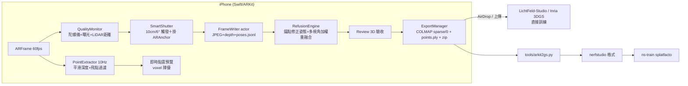

# fable — COLMAP-free 3DGS 採集 + 手機端訓練

用 iPhone ARKit（＋LiDAR）直接在手機端取得 **RGB 影像 + 精準相機內外參 + 初始化點雲**，
完全跳過 COLMAP SfM，**並可直接在手機上訓練成 3D Gaussian Splatting、當場拖曳檢視**——
不需電腦、不需上傳。也可匯出標準 COLMAP 資料集送桌機訓練。

```
掃描 → 手機上按「訓練成 3DGS」→ 拖曳轉動檢視 → 匯出 .zip
（或）掃描 → AirDrop 一個 zip → ns-train splatfacto，中間沒有任何 SfM 等待時間
```

| 傳統管線 | 本系統 |
|---|---|
| 拍影片 → 抽幀 → COLMAP SfM（數十分鐘～數小時，可能失敗） | ARKit VIO 即時輸出姿態（0 秒） |
| 姿態品質依賴特徵匹配，弱紋理場景直接崩潰 | VIO 融合 IMU，弱紋理仍穩定 |
| 尺度任意（scale ambiguity） | 公制尺度（公尺），LiDAR 加持 |
| 拍壞了回家才知道 | 即時品質警告＋涵蓋率視覺化，現場補拍 |

---

## 0. 手機端直接訓練 3DGS（on-device）

掃完後在手機上按「**訓練成 3DGS**」，直接在裝置的 GPU 上跑 Gaussian Splatting 訓練，
完成後**拖曳（trackball）自由轉動檢視**，滿意再匯出。全程不需電腦、不需上傳。

```
掃描 → 點雲優化(processing) → 驗收(review) → 訓練成 3DGS(training) → 拖曳檢視 → 匯出/重訓
```

- **訓練器**：vendored [msplat](https://github.com/rayanht/msplat)（純 Metal 的 3DGS 訓練引擎，Apache-2.0），
  編進 app（`fable/Training/msplat/`）。輸入直接吃 fable 自產的 COLMAP（`sparse/0` + `images/`），
  `points3D`（LiDAR 彩色點雲）當初始化 —— 零轉換。
- **即時預覽**：訓練中每數十步 render 一張，看它「越訓越清晰」；可即時拖曳轉動（trackball）。
- **記憶體/散熱**：高斯數設硬上限、訓練影像降採樣常駐、過熱自動暫停；並開啟
  `com.apple.developer.kernel.increased-memory-limit` entitlement。
- **裝置需求**：建議 **iPhone 15 / 16 Pro 以上**（8GB RAM + LiDAR）。
- **可調參數**（`fable/Capture/CaptureConfig.swift`）：`trainIterations`（預設 4000）、
  `trainSHDegree`（0–1）、`trainMaxGaussians`（記憶體天花板，預設 12 萬）、
  `trainDownscale`（訓練影像降採樣）、`trainThermalThrottle`。記憶體不足就把前兩者調小、downscale 調大。

> 匯出的 `.zip` 內含 `gaussians.ply`（訓練結果）＋標準 COLMAP 資料集，可另在桌機用
> LichtFeld-Studio / Inria 全力再訓練得到更高品質。

---

## 1. UI/UX 互動流程

```
┌────────┐  ┌──────────────┐  ┌─────────────────┐  ┌───────────────────┐  ┌─────────────────┐  ┌────────────┐
│ 首頁    │→ │ AR 預覽(idle) │→ │ 掃描中(scanning)  │→ │ 點雲優化(processing)│→ │ 驗收(review)      │→ │ 匯出(done)   │
│ 選模式  │  │ 物件模式：點擊 │  │ 智慧快門自動抓幀   │  │ 錨點姿態修正        │  │ 3D 檢視融合點雲    │  │ zip 完成     │
└────────┘  │ 物件放置圓頂   │  │ HUD 品質導引      │  │ 多視角加權重融合    │  │ 匯出/續掃補洞/捨棄  │  │ ShareLink /  │
            └──────────────┘  └─────────────────┘  │（進度條）           │  │（單指轉、雙指縮放） │  │ AirDrop      │
                                                   └───────────────────┘  └─────────────────┘  └────────────┘
```

**驗收（Review）階段**是品質守門員：停止掃描後手機先做「姿態修正＋重融合」，
再以 3D 檢視器呈現**實際會匯出**的點雲與相機軌跡 —— 看到破洞按「繼續掃描」回到
同一世界座標補拍（ARKit 自動重新定位），確認滿意才打包分享，不浪費一次上傳。

掃描中的 HUD 各元件與觸發條件：

| 元件 | 觸發 | 視覺 |
|---|---|---|
| 警告膠囊（頂部） | 追蹤丟失 / 移動過快 / 過暗 / 過亮 / 過近 / 過遠 / 過熱 | 兩級制：橘 = 提醒（照拍）、紅 = 遮斷（暫停抓幀，模糊 >16px 或追蹤丟失）+ 觸覺回饋 |
| 全螢幕紅框 | 遮斷級警告（抓幀暫停中） | 紅色描邊呼吸提示 |
| 速度儀 | 每幀更新「動態模糊風險」= (ω + v/z)·f·t_exp | 龜→兔進度條，綠（<8px）→橘→紅（>16px） |
| **即時點雲疊加** | 每 0.1 秒連續加權融合 LiDAR 平滑深度（與快門解耦），Scaniverse 式流動長出、越掃越準 | 彩色點雲貼在被掃表面上（1cm voxel、飛點過濾、模糊閘門）；按 1.2m 空間磚掛 ARAnchor —— 漂移校正時點雲跟著實體移動、不產生殘影；左上角按鈕可開關 |
| 軌跡折線＋視向箭錐 | 每個關鍵幀 | 青色線框錐 = 已拍視角 |
| 涵蓋率圓頂（物件模式） | 從某方位拍到物件 → 該格轉綠 | 24×5 格半球，灰格 = 死角 |
| 統計面板 | 持續 | 幀數 / 點數 / 涵蓋 % / 預估容量 |

**智慧快門**：每移動 10cm **或** 轉動 6° 自動存一幀（可調），而非固定 fps —— 原地不動不浪費儲存，移動快慢自動適應，視角分佈天然均勻。品質不合格（模糊/追蹤丟失）時快門暫停，條件持續成立、恢復即補拍。

## 2. 資料管線



手機端 zip 內容（`scan_yyyyMMdd_HHmmss/`）—— **本身就是標準 COLMAP 資料集**：

```
images/frame_00001.jpg        # 1920×1440 sensor 方向 RGB（訓練影像）
sparse/0/cameras.bin          # PINHOLE 內參（COLMAP binary 格式）
sparse/0/images.bin           # w2c 姿態：四元數(wxyz)+平移，OpenCV 相機慣例
sparse/0/points3D.bin         # 擇優下採樣後的 LiDAR 彩色點雲（3DGS 初始化）
points.ply                    # 同一點雲的 PLY 副本（快速檢視 / nerfstudio 種子點）
depth/frame_00001_depth.bin   # 256×192 float32 原始深度（sidecar，訓練器忽略）
poses.jsonl / meta.json       # 原始感測紀錄（sidecar，供 tools/ 重處理與健檢）
```

**最短路徑：zip 解壓後直接把資料夾丟給 [LichtFeld-Studio](https://github.com/MrNeRF/LichtFeld-Studio) 或 Inria `train.py -s`，零轉換。**`tools/arkit2gs.py` 提供進階重處理（品質過濾、portrait 旋正、世界軸重定向、nerfstudio 格式、深度重建點雲）。

> **上下方向**：`sparse/0` 預設已繞世界 X 軸翻 180°，對齊 COLMAP/3DGS 慣例 —— ARKit 原生 +Y-up 直接匯入會顛倒（詳見 [docs/COORDINATES.md §3.1](docs/COORDINATES.md)）。若你的 viewer 反而變顛倒，Swift 端設 `CaptureConfig.flipWorldUpForExport = false`、Python 端加 `--no-colmap-flip-up`。`points.ply` 保留 ARKit +Y-up 原生幀。

## 3. 專案結構

```
fable/
├── fable.xcodeproj / fable/          # iOS App（Xcode 26+，iOS 17+，建議 iPhone Pro 系列）
│   ├── ContentView.swift             # 首頁
│   ├── Training/                     # 手機端 3DGS 訓練：MsplatTrainer.swift（Swift 包裝）
│   │   └── msplat/                   #   vendored msplat（Metal 3DGS 訓練器，Apache-2.0）
│   └── Capture/
│       ├── CaptureController.swift   # ARKit session 主控＋熱路徑抓幀
│       ├── QualityMonitor.swift      # 角速度/模糊/光線/距離/散熱監控
│       ├── SmartShutter.swift        # 距離+角度差抓幀決策
│       ├── FrameWriter.swift         # actor：背景 JPEG/深度/姿態寫入
│       ├── PointCloudAccumulator.swift # actor：LiDAR 反投影→voxel→PLY
│       ├── CoverageVisualizer.swift  # SceneKit 軌跡+視角圓頂
│       ├── ExportManager.swift       # transforms.json + zip（零依賴）
│       └── UI/                       # CaptureView + HUDOverlay
├── tools/                            # Python 3.10+（numpy + Pillow）
│   ├── arkit2gs.py                   # 主轉換器 → nerfstudio / colmap
│   ├── geometry.py                   # 座標系轉換核心（含完整推導註解）
│   ├── colmap_io.py / ply_io.py      # 格式讀寫
│   ├── validate_dataset.py           # 資料集健檢
│   ├── make_synthetic_scan.py        # 合成資料（無手機也能測管線）
│   └── test_math.py                  # 座標數學自動驗證
└── docs/
    ├── COORDINATES.md                # 座標系數學推導與陷阱
    ├── TRAINING.md                   # 免 COLMAP 訓練設定（splatfacto/Inria/gsplat）
    └── DEVICE_NOTES.md               # 散熱/記憶體/Rolling Shutter 實戰
```

## 4. 快速開始

**iOS 端**：用 Xcode 開 `fable.xcodeproj` → 選自己的 Team → 裝到 iPhone（LiDAR 機種最佳）→ 掃描 → 分享 zip。

**Python 端**（無手機先用合成資料驗證整條管線）：

```bash
cd tools
python3 -m venv .venv && .venv/bin/pip install -r requirements.txt
source .venv/bin/activate

python test_math.py                       # 座標轉換數學驗證（7 項）
python make_synthetic_scan.py /tmp/scan   # 產生合成掃描
python arkit2gs.py /tmp/scan -o /tmp/ds --format both
python validate_dataset.py /tmp/ds/nerfstudio
```

**真實資料**：

```bash
unzip scan_20260721_103000.zip

# 直接訓練（zip 內建 COLMAP 格式，零轉換）
LichtFeld-Studio -d scan_20260721_103000 -o output     # LichtFeld-Studio（GUI 開資料夾亦可）
python train.py -s scan_20260721_103000                # Inria graphdeco 3DGS

# 進階重處理（nerfstudio 格式 / 模糊過濾 / portrait 旋正）
python arkit2gs.py scan_20260721_103000 -o dataset --format both --max-blur 8
python validate_dataset.py scan_20260721_103000 --plot
ns-train splatfacto --data dataset/nerfstudio
```

詳細訓練參數（相機微調、eval split、深度監督）見 [docs/TRAINING.md](docs/TRAINING.md)。

## 5. 拍攝守則（給使用者的三句話）

1. **多平移、少原地旋轉** —— 視差才能養出好幾何；原地掃視是 3DGS 頭號殺手。
2. **跟著圓頂的灰格走** —— 灰格 = 未涵蓋死角 = 訓練後的破洞。
3. **看到紅框就放慢** —— 紅框表示動態模糊風險，該幀不會被存檔，慢下來自然續拍。
